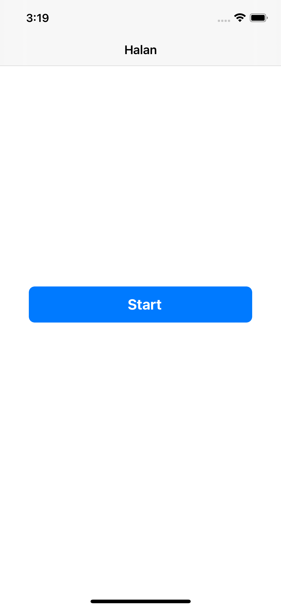
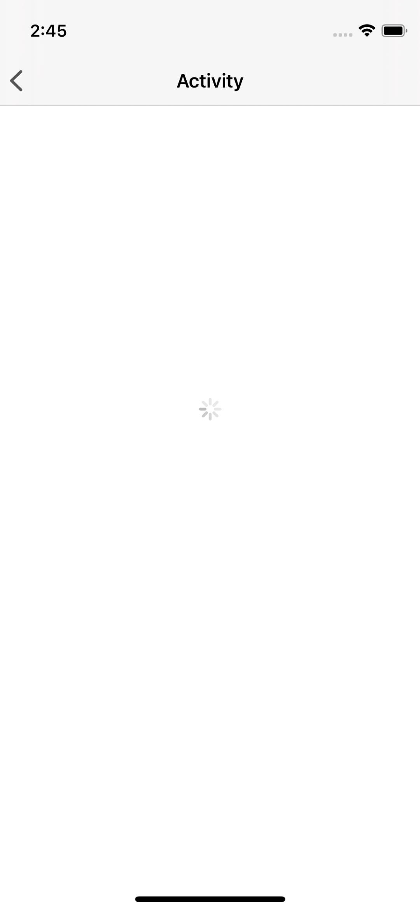
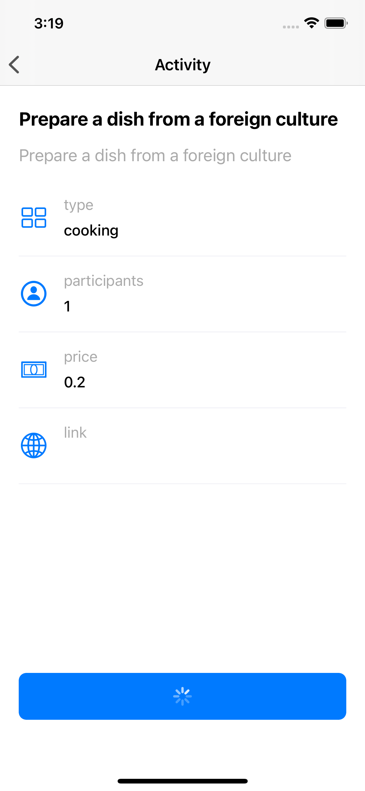

# Halan Assignment - iOS Developer 

Assignment Requirement: Create a simple iOS mobile application that:

* The user is presented with a random activity.
* Create Design-System Button
* Use this api (https://www.boredapi.com/api/activity)
* You can replace current activity with another random activity.

## Key features: 

* Show loading indicator when activity api is calling.
* Show activity data after api is called.
* Show error message when problem happened.
* User can replace current activity with another random activity.

## Demo

* [Google Drive ](https://drive.google.com/file/d/1V6OGdyGi3mgMOt21forWsV27VwkNqKk-/view?usp=sharing) 

## Screenshots

| Start Screen | Activty Loading View | Activty UI Data | Button Loading | Screens Demo |
| --- | --- | --- | | --- |
| |  |  | |  |


## Tech Stack

*  Swift 5
*  UIKit
*  Moya (networking layer)
*  MVVM architecture implement
*  Codable (Object mapping)

## Architecture

Clean Architecture with MVVM pattern in the presentation layer

## Setup

```
pod install
```
